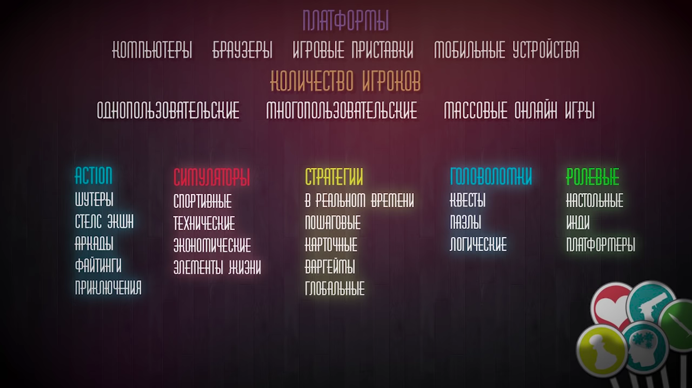

# gameDev-Uzbekiston

Hammaga Assalomu Alaykum), bu proektham operSource buladi nasb busa)

Bu dars Youtube: [Cyberstars - Как создать игру](https://m.youtube.com/channel/UC6sAHpsU5HJgiy6090fowCg)
kanalidan uzbekcha tarjimasi buladi)

# Kirish
O'yin yaratish uchun asosan 3 narsa kerak:
1. Idea
2. Bilim
3. Voqt

Davomi:
1. Yaxshi nom kerak, Iloji boricha bir nasafga aytiladigan nom topish kerak.
2. Janr: 

## GameDevs Professialari:

