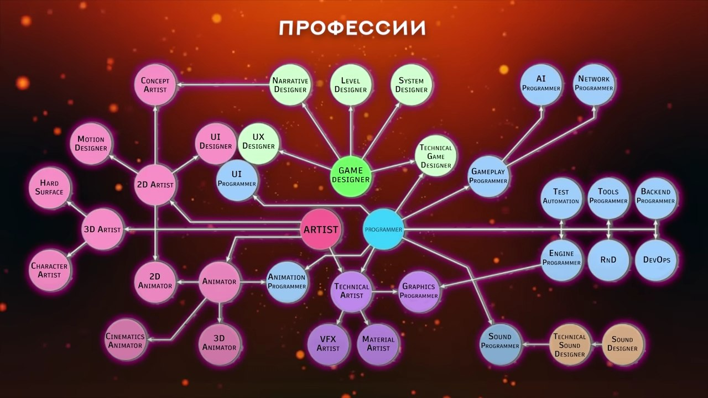

# gameDev-Uzbekiston

Hammaga Assalomu Alaykum), bu proektham operSource buladi nasb busa)

Bu dars Youtube: [Cyberstars - Как создать игру](https://m.youtube.com/channel/UC6sAHpsU5HJgiy6090fowCg)
kanalidan uzbekcha tarjimasi buladi)

# Kirish
O'yin yaratish uchun asosan 3 narsa kerak:
1. Idea
2. Bilim
3. Voqt
4

va:
1. Yaxshi nom kerak, Iloji boricha bir nasafga aytiladigan nom topish kerak.
2. Platforma tanlaysiz va Janrham tanlaysiz

## Platformalar
* Kompyuter
* Brauzer
* O'yin pristafkalar: Playstation, XBox...
* Mobil: Android, iOS

## O'yini o'ynalish turi, onlayn yoki oflayn
* Bir foydalanuvchi
* Ko'p foydalanuvchi

## Janr
* Ekshin:
  * ...
* Simulator:
  * ...
* Miya mashqlar:
  * ...
va hokozo...

## 3. Dizayn turi
Realistic yoki Casual

yoki Sujetniy, Rol yaratasiz yani:

## Kerak bo'ladigan Dasturlash tillari
* C++
* C#
* Java
va kodni rendinglashga esa DirectX va OpenGL

## 

## GameDevs Professialari:

